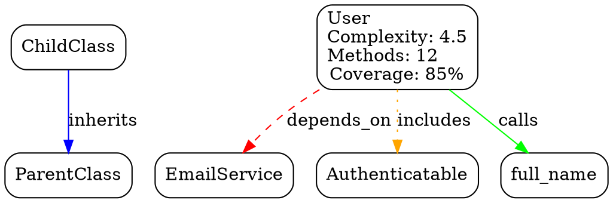

# Rubymap Implementation Plan

> Generated: 2026-05-09
> Based on comprehensive codebase audit of v0.1.0

## Executive Summary

Rubymap v0.1.0 has a solid architectural foundation and a working happy path (static parse → LLM markdown). However, the gap between documented/marketed features and actual functionality is significant. Approximately 40% of features listed in the README as "Currently Implemented" are either not integrated into the working pipeline or exist only as class skeletons.

Of 1739 tests: 1604 pass, 130 are pending, 5 fail (3 environmental `ps`-based memory tests, 2 write-permission tests).

### Root Cause

The critical blocker is that the extractor does not capture **intra-method call data**. The MethodExtractor extracts method signatures (name, params, visibility) but does not traverse method bodies to record calls like `validates`, `has_many`, `before_action`, etc. The ModelEnricher and ControllerEnricher — which contain sophisticated Rails pattern detection logic — iterate `method.calls_made`, which is never populated. These enrichers are dead code until the extractor is enhanced.

A secondary blocker: `Pipeline#merge_result!` drops most extracted data (mixins, attributes, dependencies, patterns, class_variables, aliases) when converting Extractor::Result objects into hashes for the normalizer.

---

## Critical Path Visualization

```
                    ┌────────────────────────────────┐
                    │  PHASE 1: EXTRACTOR FIXES       │ ← BLOCKS PHASES 2, 3, 5
                    │  (4-6 days)                     │
                    └───────────────┬────────────────┘
                                    │
            ┌───────────────────────┼───────────────────────┐
            │                       │                       │
            ▼                       ▼                       ▼
┌───────────────────────┐ ┌──────────────────┐ ┌──────────────────────┐
│ PHASE 2: DATA FLOW    │ │ PHASE 3: EMITTER │ │ PHASE 5: RAILS       │
│ FIX (3-4 days)        │ │ FORMATS (5-7 d)  │ │ MAPPING (4-5 days)   │
│                       │ │                  │ │                      │
│ Pipeline passes all   │ │ JSON + YAML +    │ │ Model/Controller     │
│ extracted data        │ │ GraphViz +       │ │ enrichers activated  │
│ through to emitter    │ │ Template int.    │ │                      │
└───────────┬───────────┘ └──────────────────┘ └──────────────────────┘
            │
            ▼
┌───────────────────────────────────────┐
│ PHASE 4: END-TO-END TESTS & QA        │
│ (3-4 days)                            │
│                                       │
│ Unskip core behavioral tests          │
│ Wire up fixtures → gold files         │
│ Fix all 130 pending tests             │
└───────────────────────────────────────┘
            │
            ▼
┌───────────────────────────────────────────────────────┐
│ PHASE 6: RUNTIME INTROSPECTION (6-8 days)   [PARALLEL]│
│                                                       │
│ Rails app loading, ActiveRecord reflection,            │
│ dynamic method capture, route introspection            │
└───────────────────────────────────────────────────────┘
            │
            ▼
┌───────────────────────────────────────────────────────┐
│ PHASE 7: DEVEX & POLISH (5-7 days)          [PARALLEL]│
│                                                       │
│ CLI search/view, incremental mapping, cache,           │
│ Web UI spec, GitHub integration spec                   │
└───────────────────────────────────────────────────────┘
```

---

## Phase 1: Extractor — Capture What's Needed

**Status:** CRITICAL PATH — blocks Phases 2, 3, and 5
**Effort:** 4-6 days

### Problem

The extractor extracts method *signatures* but does not analyze method *bodies*. The `MethodInfo` model has no `calls_made` field. The `CallExtractor` only handles top-level AST calls (`attr_*`, `include`, `require`, etc.) — it does not traverse into method bodies. This means:

- Rails enrichers (ModelEnricher, ControllerEnricher) never find calls to `has_many`, `validates`, `before_action`, etc.
- Method call graphs are empty (InputAdapter explicitly sets `method_calls: []`)
- `NormalizedMethod` fields `branches`, `loops`, `conditionals`, `body_lines` are never populated

### Tasks

#### 1.1 Add `calls_made` to MethodInfo (0.5 day)

**File:** `lib/rubymap/extractor/models/method_info.rb`

Add fields that downstream consumers expect:

```ruby
attr_accessor :calls_made,      # Array of {method:, arguments:, receiver:}
              :branches,         # Integer — count of branching points
              :loops,            # Integer — count of loop constructs
              :conditionals,     # Integer — count of conditional expressions
              :body_lines        # Integer — lines in method body
```

Update `to_h` to include these new fields.

#### 1.2 Build MethodBodyVisitor for intra-method analysis (2 days)

**New file:** `lib/rubymap/extractor/extractors/method_body_visitor.rb`

A visitor that traverses the body of a method definition and captures:

- Every `Prism::CallNode` — records `receiver` (constant path or nil for self), `name` (method called), `arguments`
- Control flow counts:
  - `branches`: `if/unless/case` nodes, `&&/||/and/or` in condition context
  - `loops`: `while/until/for` nodes, block calls to `.each`/`.map`/`.times`
  - `conditionals`: `if/unless/case` branching on logical expressions
- Body line count: `node.body.location.end_line - node.body.location.start_line`
- Block invocations: captures calls that receive blocks (e.g., `has_many :posts do ... end`)
- Constant references within method bodies (for dependency detection)

**Modify:** `lib/rubymap/extractor/node_visitor.rb`

In `handle_method`, after calling `MethodExtractor#extract(node)`:

```ruby
def handle_method(node)
  @extractors[:method].extract(node)
  
  # NEW: analyze method body
  body_visitor = MethodBodyVisitor.new(@context)
  body_result = body_visitor.visit(node.body)
  
  # Attach body analysis to the last MethodInfo added
  last_method = result.methods.last
  last_method.calls_made = body_result.calls
  last_method.branches = body_result.branches
  last_method.loops = body_result.loops
  last_method.conditionals = body_result.conditionals
  last_method.body_lines = body_result.lines
end
```

#### 1.3 Track method ownership context (0.5 day)

**Modify:** `lib/rubymap/extractor/extraction_context.rb`

Ensure the extraction context correctly tracks:

- `current_class` — the class/module currently being processed
- `current_method` — the method currently being processed (for attributing calls)
- These are needed so `calls_made` entries can be attributed to the right owner

Verify the existing `with_namespace` mechanism already handles this or extend it.

#### 1.4 Expand CallExtractor for class-level DSL patterns (1 day)

**Modify:** `lib/rubymap/extractor/extractors/call_extractor.rb`

Currently handles only: `attr_*`, `include`/`extend`/`prepend`, `private`/`protected`/`public`, `require`/`require_relative`, `autoload`, `alias_method`.

Add detection for Rails DSL calls that occur at class body level:

```ruby
RAILS_CLASS_LEVEL_CALLS = %w[
  has_many has_one belongs_to has_and_belongs_to_many
  validates validates_presence_of validates_uniqueness_of validates_length_of
  validates_format_of validates_inclusion_of validates_numericality_of validate
  before_validation after_validation before_save after_save
  before_create after_create before_update after_update
  before_destroy after_destroy around_save around_create around_update
  scope default_scope
  before_action after_action around_action skip_before_action
  rescue_from
  delegate
].freeze
```

Store these as patterns on the parent class/module:

```ruby
if RAILS_CLASS_LEVEL_CALLS.include?(node.name.to_s)
  pattern = PatternInfo.new(
    type: "rails_dsl",
    method: node.name.to_s,
    target: context.current_namespace,
    location: node.location,
    arguments: extract_call_arguments(node)
  )
  result.patterns << pattern
end
```

#### 1.5 Test the enhanced extractor (1 day)

Tests to write/unskip:

- `spec/extractor_spec.rb`: Un-skip "captures dynamic methods", "extracts ActiveRecord associations", "extracts methods and constants"
- New test file: `spec/extractor/method_body_visitor_spec.rb`
  - Verifies calls_made contains expected calls
  - Verifies branch/loop/conditional counts for known method bodies
  - Verifies body_line count is accurate
- `spec/extractor/extractors/call_extractor_spec.rb`: Verify Rails DSL calls are captured as patterns
- `spec/extractor/models/method_info_spec.rb`: Verify `to_h` includes new fields

### Acceptance Criteria

- [ ] `MethodInfo` has `calls_made`, `branches`, `loops`, `conditionals`, `body_lines`
- [ ] Methods containing calls to other methods have those calls recorded
- [ ] Rails DSL calls at class body level are captured as patterns
- [ ] All new code has tests
- [ ] Existing tests continue to pass

---

## Phase 2: Pipeline Data Flow Fix

**Status:** CRITICAL PATH — blocks Phases 3, 4, and 5
**Effort:** 3-4 days
**Depends on:** Phase 1

### Problem

`Pipeline#merge_result!` drops most extracted data when converting Extractor::Result objects to hashes for the normalizer. Only `name`, `type`, `superclass`, `file`, `line`, `namespace`, `documentation` are forwarded. Missing: mixins, attributes, dependencies, class_variables, aliases, patterns, and method calls_made.

The `InputAdapter` explicitly sets `method_calls: []` with the comment "Extractor doesn't provide method_calls". After Phase 1, it will.

### Tasks

#### 2.1 Fix Pipeline#merge_result! (1 day)

**File:** `lib/rubymap/pipeline.rb`

Extend `merge_result!` to forward all extracted data:

```ruby
# ADD to merge_result!:

# Mixins (include/extend/prepend)
result.mixins&.each do |mixin|
  target[:mixins] << {
    type: mixin.type,
    module_name: mixin.module_name,
    target: mixin.target,
    file: result.file_path,
    line: mixin.location&.start_line
  }
end

# Attributes (attr_accessor/reader/writer)
result.attributes&.each do |attr|
  target[:attributes] << {
    name: attr.name,
    type: attr.type,
    file: result.file_path,
    line: attr.location&.start_line
  }
end

# Dependencies (require/autoload)
result.dependencies&.each do |dep|
  target[:dependencies] << {
    type: dep.type,
    path: dep.path,
    constant: dep.respond_to?(:constant) ? dep.constant : nil,
    file: result.file_path,
    line: dep.location&.start_line
  }
end

# Patterns (Rails DSL, concerns, metaprogramming)
result.patterns&.each do |pattern|
  target[:patterns] << {
    type: pattern.type,
    method: pattern.respond_to?(:method) ? pattern.method : nil,
    target: pattern.target,
    file: result.file_path,
    line: pattern.location&.start_line,
    indicators: pattern.respond_to?(:indicators) ? pattern.indicators : []
  }
end

# Class variables and aliases
result.class_variables&.each do |cvar|
  target[:class_variables] << {
    name: cvar.name,
    file: result.file_path,
    line: cvar.location&.start_line
  }
end

result.aliases&.each do |als|
  target[:aliases] << {
    new_name: als.new_name,
    original_name: als.original_name,
    file: result.file_path,
    line: als.location&.start_line
  }
end

# METHOD calls_made (NEW - from Phase 1)
# Already handled when methods are added above; extend the method hash:
target[:methods].each do |method_hash|
  # Find the original MethodInfo to get calls_made
  orig = result.methods.find { |m| m.name == method_hash[:name] }
  if orig&.calls_made
    method_hash[:calls_made] = orig.calls_made
  end
  method_hash[:branches] = orig.branches if orig&.branches
  method_hash[:loops] = orig.loops if orig&.loops
  method_hash[:conditionals] = orig.conditionals if orig&.conditionals
  method_hash[:body_lines] = orig.body_lines if orig&.body_lines
end
```

#### 2.2 Fix InputAdapter (0.5 day)

**File:** `lib/rubymap/normalizer/input_adapter.rb`

Extend `SYMBOL_TYPES` and the adapter methods to include all data:

```ruby
SYMBOL_TYPES = [:classes, :modules, :methods, :method_calls, :mixins,
                :attributes, :dependencies, :class_variables, :aliases,
                :patterns].freeze
```

In `normalize_extractor_result`, map all fields from the Result object. Remove the `method_calls: []` hardcode — after Phase 1, calls_made from methods will flow through.

#### 2.3 Fix Normalizer processors (1 day)

**Files:** `lib/rubymap/normalizer/processors/`

- **ClassProcessor:** Ensure `NormalizedClass` struct includes `class_level_calls` from patterns and attributes from extraction
- **ModuleProcessor:** Same — include patterns found at module body level
- **MethodProcessor:** Populate `calls_made`, `branches`, `loops`, `conditionals`, `body_lines` on `NormalizedMethod` structs
- **MethodCallProcessor:** Convert calls_made entries into `NormalizedMethodCall` entries. Each call like `{method: "validates", arguments: [:name, presence: true]}` should generate a method_call to `validates` from the owning class.
- **MixinProcessor:** Handle both `MixinInfo` objects from extraction and class-level calls that are mixin-like (e.g., `include SomeModule`)

#### 2.4 Fix Enricher converters (1 day)

**Files:** `lib/rubymap/enricher/converters/`

- **ClassConverter:** Forward `class_level_calls`, `attributes`, `patterns` from NormalizedClass to EnrichedClass
- **ModuleConverter:** Forward expanded fields
- **MethodConverter:** Forward `calls_made`, `branches`, `loops`, `conditionals`, `body_lines`
- **NormalizedClassBuilder:** Include new fields in the builder output

The structs (`NormalizedClass`, `NormalizedMethod`) already have fields like `associations`, `validations`, `scopes`, `actions`, `filters`, `rescue_handlers` — verify the converters actually populate these.

#### 2.5 Integration test: verify Rails enrichers receive data (0.5 day)

Write an integration test that exercises the full chain:

```ruby
# spec/integration/rails_enricher_integration_spec.rb
RSpec.describe "Rails enricher data flow" do
  it "detects ActiveRecord model associations from extracted calls" do
    code = <<~RUBY
      class User < ApplicationRecord
        has_many :posts
        belongs_to :organization
        validates :name, presence: true
        scope :active, -> { where(active: true) }
        
        def full_name
          "#{first_name} #{last_name}"
        end
      end
    RUBY
    
    # Extract → Normalize → Enrich
    # Verify User has 2 associations, 1 validation, 1 scope
  end
end
```

### Acceptance Criteria

- [ ] `Pipeline#merge_result!` forwards fields currently dropped (mixins, attributes, dependencies, patterns, class_variables, aliases)
- [ ] Method calls_made, branches, loops, conditionals, body_lines flow from extractor through pipeline
- [ ] InputAdapter receives and processes all data types
- [ ] Normalizer processors populate all fields on domain structs
- [ ] Enricher converters forward all data
- [ ] Integration test: Rails model with `has_many`/`validates`/`scope` is correctly enriched
- [ ] All existing tests continue to pass

---

## Phase 3: Emitter Format Expansion

**Status:** Depends on Phase 2 completion
**Effort:** 5-7 days

### Problem

The README and configuration advertise JSON, YAML, and GraphViz DOT output formats. Only LLM markdown is implemented. The pipeline hard-codes `only :llm format is supported`. The template system exists as a framework (Registry, Renderer, Context, Presenters, ERB files) but the LLM emitter uses inline string building and `use_templates?` returns `false` by default.

### Tasks

#### 3.1 Build JSON Emitter (1 day)

**New file:** `lib/rubymap/emitter/emitters/json_emitter.rb`

```ruby
module Rubymap
  module Emitter
    module Emitters
      class JSON < BaseEmitter
        def emit(indexed_data)
          output = {
            metadata: build_metadata(indexed_data),
            classes: indexed_data[:classes] || [],
            modules: indexed_data[:modules] || [],
            methods: indexed_data[:methods] || [],
            graphs: indexed_data[:graphs] || {},
            relationships: build_relationships(indexed_data)
          }
          apply_redaction(JSON.pretty_generate(output))
        end

        def emit_to_directory(indexed_data, output_dir)
          ensure_directory_exists(output_dir)
          
          # Single file: rubymap.json
          path = File.join(output_dir, "rubymap.json")
          File.write(path, emit(indexed_data))
          
          # Also generate manifest
          generate_manifest(output_dir, [{path: path, relative_path: "rubymap.json"}], indexed_data)
          [{path: path, relative_path: "rubymap.json"}]
        end

        protected

        def format_extension
          "json"
        end

        private

        def build_metadata(data)
          {
            generator: {name: "rubymap", version: Rubymap.gem_version},
            generated_at: Time.now.utc.iso8601,
            source: data[:metadata] || {}
          }
        end

        def build_relationships(data)
          {
            inheritance: data.dig(:graphs, :inheritance) || [],
            dependencies: data.dig(:graphs, :dependencies) || [],
            method_calls: data.dig(:graphs, :method_calls) || [],
            mixins: data.dig(:graphs, :mixins) || []
          }
        end
      end
    end
  end
end
```

Register in `Emitter.emit` and `Emitter::EmitterManager`.

#### 3.2 Build YAML Emitter (0.5 day)

**New file:** `lib/rubymap/emitter/emitters/yaml_emitter.rb`

Same structure as JSON emitter, using `YAML.dump`. Register in `Emitter.emit`.

#### 3.3 Build GraphViz DOT Emitter (1.5 days)

**New file:** `lib/rubymap/emitter/emitters/graphviz_emitter.rb`

Converts graph data to DOT format:



Features:
- Four graph types with distinct colors
- Node labels showing key metrics
- Subgraphs for namespace grouping (optional, controlled by config)
- Output: single `.dot` file — users render with `dot -Tsvg rubymap.dot -o rubymap.svg`

Register in `Emitter.emit`.

#### 3.4 Integrate Template System into LLM Emitter (1.5 days)

**File:** `lib/rubymap/emitter/emitters/llm_emitter.rb`

Current state:
- `use_templates?` returns `false` (not the default code path)
- All markdown is generated by inline string concatenation
- The class template `lib/rubymap/templates/default/llm/class.erb` exists and is well-structured but unused

Changes needed:

1. **Make templates the default path:**
   ```ruby
   def use_templates?
     # Always try templates, fall back to inline
     defined?(Templates) && Templates::Renderer
   rescue nil
   end
   ```

2. **Fix data mapping for templates:** The `class.erb` template expects `Rubymap::Templates::Presenters::ClassPresenter`. Verify the data passed to the renderer (currently `{class: klass, klass: klass}`) maps correctly to what the presenter expects.

3. **Check and fix templates:**
   - `class.erb` — Verify it renders correctly with real enriched data
   - `module.erb` — Verify structure matches expectations
   - `hierarchy.erb` — Verify tree rendering works

4. **Add template configuration:** Allow users to set `templates.directory` in `.rubymap.yml` to override defaults. The `Renderer` already supports `template_dir` — wire it through the configuration.

5. **Keep inline fallback:** The existing hardcoded markdown generation stays as fallback when `use_templates?` returns false or a template is missing.

#### 3.5 Wire Pipeline#emit for all formats (0.5 day)

**File:** `lib/rubymap/pipeline.rb`

Remove the hard-coded LLM-only guard:

```ruby
# REMOVE:
if configuration.format != :llm
  raise ConfigurationError, "Only :llm format is supported."
end

# REPLACE WITH:
emitter = case configuration.format
when :llm then Emitters::LLM.new
when :json then Emitters::JSON.new
when :yaml then Emitters::YAML.new
when :graphviz then Emitters::Graphviz.new
else raise ConfigurationError, "Unknown format: #{configuration.format}"
end
```

**File:** `lib/rubymap/emitter.rb`

Update the emitter factory:

```ruby
def create_emitter(format, **options)
  case format
  when :llm then Emitters::LLM.new(**options)
  when :json then Emitters::JSON.new(**options)
  when :yaml then Emitters::YAML.new(**options)
  when :graphviz then Emitters::Graphviz.new(**options)
  else raise ArgumentError, "Unknown emitter format: #{format}"
  end
end
```

**File:** `lib/rubymap/configuration.rb`

Update validation:

```ruby
valid_formats = [:llm, :json, :yaml, :graphviz]
```

#### 3.6 Update CLI and documentation (0.5 day)

- CLI `map` command: add `--format` option (currently missing from the Thor definition)
- CLI `formats` command: update to list all four formats
- CLI `init` command: ask for format preference (currently skips)
- README: remove "coming soon" qualifiers from JSON/YAML/GraphViz; update examples
- `docs/rubymap.md`: update format documentation

### Acceptance Criteria

- [ ] `rubymap --format json` produces valid JSON output
- [ ] `rubymap --format yaml` produces valid YAML output
- [ ] `rubymap --format graphviz` produces valid DOT output renderable with GraphViz
- [ ] `rubymap --format llm` uses ERB templates by default, falls back to inline
- [ ] All four formats are configurable via `.rubymap.yml`
- [ ] CLI help text lists all formats
- [ ] Tests exist for each emitter

---

## Phase 4: End-to-End Test Suite & Quality Gates

**Status:** Depends on Phase 2
**Effort:** 3-4 days

### Problem

130 pending tests. Core behavioral tests in `spec/rubymap_spec.rb` are entirely skipped with "Implementation pending". There are no gold file tests for the pipeline output. The most important tests that verify the gem actually works are not running.

### Tasks

#### 4.1 Unskip core behavior tests (2 days)

**File:** `spec/rubymap_spec.rb`

Currently all behavioral tests are skipped:

```ruby
it "extracts classes and modules" do
  skip "Implementation pending"
end
it "extracts methods and constants" do
  skip "Implementation pending"
end
it "tracks inheritance relationships" do
  skip "Implementation pending"
end
it "tracks mixin relationships" do
  skip "Implementation pending"
end
it "generates LLM-friendly output" do
  skip "Implementation pending"
end
```

After Phases 1-2, these should work. Replace with real assertions:

```ruby
it "extracts classes and modules" do
  code = "class User < ApplicationRecord; end; module Authenticatable; end"
  result = extract_and_map(code)
  expect(result[:classes]).to_not be_empty
  expect(result[:classes].first[:name]).to eq("User")
  expect(result[:modules]).to_not be_empty
end
```

Similar pattern for each test — use inline Ruby code strings, run through the full pipeline, verify expected output.

#### 4.2 Gold file test fixtures (1 day)

Create `spec/fixtures/reference_project/` with a known set of Ruby files representing a realistic small application:

```
spec/fixtures/reference_project/
├── app/
│   ├── models/
│   │   ├── user.rb          # User < ApplicationRecord, has_many :posts, validates :name
│   │   └── post.rb           # Post < ApplicationRecord, belongs_to :user, scope :published
│   └── controllers/
│       └── users_controller.rb  # UsersController < ApplicationController, before_action :set_user
├── lib/
│   └── services/
│       └── user_service.rb   # UserService, include Authenticatable, def create_user
└── config/
    └── routes.rb             # Rails.application.routes.draw do ... end
```

Generate expected output for each format as gold files:

```
spec/fixtures/reference_project/expected/
├── llm/
│   ├── index.md
│   ├── overview.md
│   ├── relationships.md
│   ├── chunks/
│   │   ├── user.md
│   │   ├── post.md
│   │   └── users_controller.md
│   └── manifest.json
├── json/
│   └── rubymap.json
├── yaml/
│   └── rubymap.yaml
└── graphviz/
    └── rubymap.dot
```

Test compares pipeline output against gold files:

```ruby
RSpec.describe "Pipeline output" do
  formats = [:llm, :json, :yaml, :graphviz]
  
  formats.each do |format|
    it "produces correct #{format} output for reference project" do
      result = Rubymap.map("spec/fixtures/reference_project", format: format)
      expected_dir = "spec/fixtures/reference_project/expected/#{format}"
      
      # Compare output files against expected
      Dir.glob("#{result[:output_dir]}/**/*").each do |file|
        relative = Pathname.new(file).relative_path_from(Pathname.new(result[:output_dir]))
        expected = File.join(expected_dir, relative)
        expect(File.read(file)).to eq(File.read(expected))
      end
    end
  end
end
```

#### 4.3 Address remaining pending tests (1 day)

Categorize and fix pending tests by priority:

**High priority (implement or unskip):**
- `spec/extractor_spec.rb`: 6 pending tests — already addressed by Phase 1
- `spec/normalizer_spec.rb`: 3 pending tests — unskip if normalizer handles expanded data
- `spec/emitters_spec.rb`: 1 pending "Implementation pending" — unskip after Phase 3
- `spec/rails_mapper_spec.rb`: 5 pending "Runtime introspection not yet implemented" — leave pending, addressed in Phase 6
- `spec/enricher_spec.rb`: "uses memory efficiently" — fix `ps` dependency (use Ruby's `ObjectSpace` or `GetProcessMem` gem)
- `spec/indexer_spec.rb`: "manages memory efficiently" — same fix

**Medium priority:**
- Performance/scalability tests — convert from `ps`-based to Ruby-native memory measurement
- Symlink handling tests — implement or explicitly mark as future work
- Resumable processing tests — depends on Phase 7 cache work

**Low priority (leave pending with clear reasons):**
- "Disk space simulation not implemented" — genuine future feature
- "Memory profiling not implemented" — genuine future feature

#### 4.4 Fix 5 failing tests (0.5 day)

Three memory tests fail because they shell out to `ps`, which doesn't exist in container environments:

```ruby
# Current (broken in containers):
start_memory = `ps -o pid,rss -p #{Process.pid}`.split.last.to_i

# Fix — use Ruby-native approach or skip gracefully:
def get_memory_usage
  if system("which ps > /dev/null 2>&1")
    `ps -o rss= -p #{Process.pid}`.to_i
  else
    # Container environment — use Ruby's GC.stat or GetProcessMem
    begin
      require "get_process_mem"
      GetProcessMem.new.mb.to_i
    rescue LoadError
      0 # Can't measure, skip memory assertions
    end
  end
end
```

Two write-permission tests may fail in CI — verify they work in a temp directory and clean up after themselves.

### Acceptance Criteria

- [ ] All core behavioral tests unskipped and passing
- [ ] Gold file tests exist for all four output formats
- [ ] Gold file tests pass against reference project
- [ ] Remaining pending tests have clear, honest reasons (not just "Implementation pending")
- [ ] All 5 currently failing tests pass
- [ ] `bundle exec rspec` runs green with 0 failures

---

## Phase 5: Rails Deep Mapping

**Status:** Depends on Phases 1 and 2
**Effort:** 4-5 days

### Problem

The `ModelEnricher` and `ControllerEnricher` have sophisticated logic for detecting Rails patterns, but they receive no data because method call extraction doesn't populate `calls_made`. Once Phases 1-2 deliver this data, these enrichers become functional. Additionally, `JobEnricher` and `MailerEnricher` don't exist yet.

### Tasks

#### 5.1 Activate and test ModelEnricher (1.5 days)

**File:** `lib/rubymap/enricher/rails/model_enricher.rb`

This class already has complete logic for:
- Detecting ActiveRecord models via superclass matching
- Extracting associations from `has_many`/`belongs_to`/etc. calls
- Extracting validations from `validates`/`validates_presence_of`/etc.
- Extracting callbacks from `before_save`/`after_create`/etc.
- Extracting scopes from `scope`/`default_scope`
- Computing model complexity scores
- Detecting issues (N+1 risks, callback hell, missing validations, missing indexes)

**What needs to happen:**
1. Verify the `is_activerecord_model?` detection works with data flowing from Phase 1-2
2. Verify `extract_associations`, `extract_validations`, `extract_callbacks`, `extract_scopes` correctly parse calls_made
3. Fix any data format mismatches between what the extractor produces and what the enricher expects
4. Write comprehensive tests:

```ruby
# spec/enricher/rails/model_enricher_spec.rb
RSpec.describe Rubymap::Enricher::Rails::ModelEnricher do
  it "detects associations from has_many calls" do
    model = build_class_with_calls("User", "ApplicationRecord", [
      {method: "has_many", arguments: [:posts]},
      {method: "belongs_to", arguments: [:organization]}
    ])
    result = enricher.enrich(model)
    expect(result.associations).to contain_exactly(
      {type: "has_many", name: "posts", class_name: "Post"},
      {type: "belongs_to", name: "organization", class_name: "Organization"}
    )
  end
end
```

#### 5.2 Activate and test ControllerEnricher (1.5 days)

**File:** `lib/rubymap/enricher/rails/controller_enricher.rb`

Already has logic for:
- Detecting controllers via superclass or naming convention
- Extracting actions (public methods)
- Extracting filters (`before_action`, `after_action`, etc.)
- Extracting `rescue_from` handlers
- Extracting strong parameter patterns
- Computing REST compliance scores
- Detecting issues (fat controller, missing auth, missing error handling)

**What needs to happen:**
1. Verify controller detection works
2. Verify filter extraction parses calls_made correctly
3. Test with realistic controller fixture:

```ruby
it "extracts before_action filters" do
  controller = build_class_with_calls("UsersController", "ApplicationController", [
    {method: "before_action", arguments: [:set_user, {only: [:show, :edit, :update, :destroy]}]}
  ])
  result = enricher.enrich(controller)
  expect(result.filters).to include(
    hash_including(type: "before_action", method: "set_user")
  )
end
```

#### 5.3 Add Job/Mailer/Channel enrichers (1 day)

**New file:** `lib/rubymap/enricher/rails/job_enricher.rb`

```ruby
module Rubymap
  class Enricher
    module Rails
      class JobEnricher < BaseEnricher
        JOB_INDICATORS = %w[ApplicationJob ActiveJob::Base].freeze
        
        def enrich(result, config)
          result.classes.each do |klass|
            next unless is_active_job?(klass)
            
            job_info = RailsJobInfo.new(
              name: klass.name,
              queue_name: extract_queue_name(klass),
              retry_settings: extract_retry_settings(klass),
              perform_method: find_perform_method(klass)
            )
            
            result.rails_jobs << job_info
            klass.is_rails_job = true
          end
        end
        
        # ... detection and extraction logic
      end
    end
  end
end
```

**New file:** `lib/rubymap/enricher/rails/mailer_enricher.rb`

Similar pattern — detects `ActionMailer::Base` subclasses, extracts mailer actions, default from/to settings.

Register both in `ComponentFactory#create_rails_enrichers`.

#### 5.4 Static route parsing (1 day)

**New file:** `lib/rubymap/enricher/rails/route_parser.rb`

Parse `config/routes.rb` using Prism to extract route definitions statically:

```ruby
module Rubymap
  class Enricher
    module Rails
      class RouteParser
        def parse(routes_file_path)
          return [] unless File.exist?(routes_file_path)
          
          code = File.read(routes_file_path)
          parse_result = Prism.parse(code)
          extract_routes(parse_result.value)
        end
        
        private
        
        def extract_routes(node)
          # Traverse AST for:
          # - resources :users
          # - get "/path", to: "controller#action"
          # - namespace :admin do ... end
          # - scope module: "api" do ... end
        end
      end
    end
  end
end
```

Output: Array of route hashes with `{path:, method:, controller:, action:, constraints:}`.

### Acceptance Criteria

- [ ] ModelEnricher correctly detects and enriches ActiveRecord models
- [ ] ControllerEnricher correctly detects and enriches Rails controllers
- [ ] JobEnricher detects ActiveJob classes
- [ ] MailerEnricher detects ActionMailer classes
- [ ] Static route parser extracts routes from `config/routes.rb`
- [ ] Integration tests pass with real Rails-like fixtures
- [ ] All extracted Rails metadata appears in LLM output

---

## Phase 6: Runtime Introspection

**Status:** PARALLEL TRACK — can begin after Phase 1
**Effort:** 6-8 days

### Problem

The README promises "Runtime introspection — Capture dynamically defined methods and runtime code." Configuration has `runtime.enabled`, `runtime.timeout`, `runtime.safe_mode`. The CLI has `--runtime` flag. All runtime-related tests are `pending "Runtime introspection not yet implemented"`. Zero implementation code exists.

### Tasks

#### 6.1 Rails environment booting with sandboxing (2 days)

**New file:** `lib/rubymap/runtime/bootstrapper.rb`

```ruby
module Rubymap
  module Runtime
    class Bootstrapper
      def initialize(config)
        @config = config
        @timeout = config["timeout"] || 30
        @safe_mode = config["safe_mode"] || true
        @skip_initializers = config["skip_initializers"] || []
      end
      
      def boot(app_root)
        # 1. Require config/environment.rb or config/application.rb
        # 2. Set RAILS_ENV to config environment
        # 3. Skip specified initializers by temporarily renaming or patching
        # 4. Run boot in a forked process with timeout
        # 5. Return booted Rails.application or raise BootError
      end
      
      def safe_mode?
        @safe_mode
      end
      
      def sandbox
        # Use ActiveRecord::Base.connection_pool.with_connection
        # Wrap in transaction and rollback to prevent writes
        # Or use a read-only database user
      end
    end
  end
end
```

Key design decisions:
- **Fork for isolation:** Boot Rails in a forked process. If it hangs (initializer loops, database timeout), kill the fork. Pipe results back via `IO.pipe`.
- **Safe mode:** When enabled, monkey-patch `ActiveRecord::Base.connection` to use a read-only transaction that always rolls back.
- **Skip initializers:** Allow users to skip heavy initializers that load external services.
- **Error handling:** Boot failures produce `RuntimeBootError` with clear messages, not crashes.

#### 6.2 ActiveRecord model introspection (1.5 days)

**New file:** `lib/rubymap/runtime/active_record_introspector.rb`

```ruby
module Rubymap
  module Runtime
    class ActiveRecordIntrospector
      def introspect(model_class)
        {
          table_name: model_class.table_name,
          columns: model_class.columns.map { |c| column_info(c) },
          associations: model_class.reflect_on_all_associations.map { |a| association_info(a) },
          validators: model_class.validators.map { |v| validator_info(v) },
          enums: model_class.defined_enums,
          scopes: extract_scopes(model_class),
          # Runtime-only: actual column types, defaults, null constraints from DB
          indexes: model_class.connection.indexes(model_class.table_name)
        }
      end
      
      def column_info(column)
        {
          name: column.name,
          type: column.type,
          sql_type: column.sql_type,
          default: column.default,
          null: column.null,
          limit: column.limit,
          precision: column.precision,
          scale: column.scale
        }
      end
      
      # ... association_info, validator_info, etc.
    end
  end
end
```

This captures data the static analyzer cannot: actual database column types, generated attribute methods (e.g., `User#name`, `User#name=`), STI types, polymorphic associations with concrete class names.

#### 6.3 Dynamic method capture (1 day)

**New file:** `lib/rubymap/runtime/dynamic_method_detector.rb`

```ruby
module Rubymap
  module Runtime
    class DynamicMethodDetector
      def capture(callback:)
        @captured = []
        @callback = callback
        
        # Use TracePoint to capture method definitions
        trace = TracePoint.new(:call) do |tp|
          if tp.method_id == :define_method && tp.defined_class == Module
            method_name = tp.binding.local_variable_get(:name) rescue nil
            if method_name
              @captured << {
                type: :define_method,
                name: method_name,
                defined_in: tp.self.name,
                location: "#{tp.path}:#{tp.lineno}"
              }
            end
          end
        end
        
        trace.enable
        yield if block_given?
        trace.disable
        
        @captured
      end
    end
  end
end
```

Also detect:
- `method_missing` definitions
- `const_missing` definitions
- ActiveSupport's `delegate` in runtime context
- `class_eval`/`instance_eval` that define methods
- ActiveRecord's dynamic attribute methods

#### 6.4 Route introspection at runtime (1 day)

**New file:** `lib/rubymap/runtime/route_introspector.rb`

```ruby
module Rubymap
  module Runtime
    class RouteIntrospector
      def introspect
        return [] unless defined?(Rails) && Rails.application
        
        Rails.application.routes.routes.map do |route|
          {
            name: route.name,
            path: route.path.spec.to_s,
            verb: route.verb,
            controller: route.defaults[:controller],
            action: route.defaults[:action],
            constraints: route.constraints,
            defaults: route.defaults
          }
        end
      end
    end
  end
end
```

This is more complete than static route parsing because it captures:
- Mounted engines
- Wildcard/glob routes
- Constraints that are lambdas/procs
- Route helpers generated by Rails

#### 6.5 Runtime data merging (0.5 day)

**Modify:** `lib/rubymap/normalizer/input_adapter.rb`

Add a method to accept runtime data as a separate source:

```ruby
def adapt_runtime(runtime_data)
  # runtime_data comes from Runtime::* introspectors
  # Merge with static data, giving runtime higher precedence
  {
    classes: runtime_data[:models] || [],
    modules: runtime_data[:modules] || [],
    methods: runtime_data[:dynamic_methods] || [],
    # ... etc
  }
end
```

**Modify:** `lib/rubymap/normalizer.rb`

The precedence system currently has:
```ruby
DATA_SOURCES[:static] => 6     # Highest
DATA_SOURCES[:runtime] => 5    # Lower than static
```

Consider: should runtime data have *higher* precedence? Runtime data is ground truth (actual column types, actual associations). But static data is safer (no side effects). Make this configurable:

```ruby
# Default: runtime has higher precedence for DB schema, same for other data
SOURCE_PRECEDENCE[merged_source] = config[:runtime_precedence] || 7
```

**Modify:** `lib/rubymap/pipeline.rb`

In `Pipeline#run`, when `configuration.runtime["enabled"]` is true:
1. After extraction, run `Runtime::Bootstrapper#boot`
2. Run introspectors on booted app
3. Pass runtime data to normalizer as a second input
4. Normalizer merges with appropriate precedence

#### 6.6 Test runtime introspection (1 day)

- Unskip all `pending "Runtime introspection not yet implemented"` tests in `spec/cli_spec.rb` and `spec/rails_mapper_spec.rb`
- Create `spec/fixtures/minimal_rails_app/` for testing
- Test sandboxing: verify no database writes occur
- Test timeout: verify hung initializers are killed
- Test error isolation: verify one failing introspector doesn't crash the whole pipeline

### Acceptance Criteria

- [ ] `rubymap --runtime` boots a Rails app in sandboxed mode
- [ ] ActiveRecord model introspection captures associations, validations, columns
- [ ] Dynamic method detection captures `define_method` calls
- [ ] Route introspection captures complete route table
- [ ] Runtime data merges with static extraction data
- [ ] Safe mode prevents database writes
- [ ] Timeout prevents hung boots
- [ ] All runtime-related pending tests pass
- [ ] Runtime features are configurable via `.rubymap.yml`

---

## Phase 7: Developer Experience & Polish

**Status:** PARALLEL TRACK — independent of critical path
**Effort:** 5-7 days

### Tasks

#### 7.1 CLI `view` command (1 day)

**File:** `lib/rubymap/cli.rb`

Currently says "Symbol viewing not yet fully implemented". Implement it:

```ruby
desc "view SYMBOL", "Display information about a class or module"
def view(symbol_name)
  output_dir = "rubymap_output" # or from config
  
  # Load manifest
  manifest = JSON.parse(File.read(File.join(output_dir, "manifest.json")))
  
  # Find matching chunks
  matches = manifest["chunks"].select do |chunk|
    title = chunk["title"] || ""
    title.downcase.include?(symbol_name.downcase) ||
      chunk["primary_symbols"]&.any? { |s| s.to_s.downcase.include?(symbol_name.downcase) }
  end
  
  if matches.empty?
    # Fuzzy search
    matches = manifest["chunks"].select do |chunk|
      # Levenshtein distance or substring match
      chunk["title"].to_s.downcase.chars.each_cons(symbol_name.length).any? { |c| c.join == symbol_name.downcase[0..-1] }
    end
  end
  
  # Display results
  matches.each do |match|
    chunk_path = File.join(output_dir, "chunks", match["filename"])
    if File.exist?(chunk_path)
      content = File.read(chunk_path)
      # Use TTY::Pager for long content, or TTY::Table for structured display
      puts format_for_terminal(content, match)
    end
  end
end
```

#### 7.2 Incremental mapping (2 days)

**Modify:** `lib/rubymap/pipeline.rb`

Store metadata about the last run:

```ruby
# In output_dir/.rubymap_state.yml
state = {
  last_run: "2026-05-09T15:10:48Z",
  file_states: {
    "app/models/user.rb" => {mtime: 1715267448, checksum: "abc123"},
    "app/models/post.rb" => {mtime: 1715267400, checksum: "def456"}
  }
}
```

On `rubymap update`:
1. Load state file
2. Find files with changed mtime or checksum
3. Find files that existed before but don't now (deleted)
4. Find new files that didn't exist before
5. Only extract changed/new files
6. Remove chunks for deleted files
7. Rebuild indexes and graphs with updated data
8. Save new state

**New file:** `lib/rubymap/incremental_state.rb`

```ruby
module Rubymap
  class IncrementalState
    def initialize(output_dir)
      @state_path = File.join(output_dir, ".rubymap_state.yml")
      @state = load_state
    end
    
    def changed_files(paths)
      # Returns [modified, deleted, new]
    end
    
    def save(file_results)
      # Update state with current mtimes and checksums
    end
  end
end
```

#### 7.3 Cache system (1.5 days)

**New file:** `lib/rubymap/cache.rb`

The configuration already has cache settings. Implement them:

```ruby
module Rubymap
  class Cache
    def initialize(config)
      @directory = config.dig("cache", "directory") || ".rubymap_cache"
      @ttl = config.dig("cache", "ttl") || 86400
      @enabled = config.dig("cache", "enabled") || false
    end
    
    def cache_key(paths, config)
      # Deterministic key based on:
      # - File paths (sorted)
      # - File mtimes
      # - Config hash (exclude volatile settings)
      digest = Digest::SHA256.new
      digest << paths.sort.join(":")
      paths.each { |p| digest << File.mtime(p).to_i.to_s rescue nil }
      digest << config.reject { |k| %w[verbose progress].include?(k) }.to_s
      digest.hexdigest
    end
    
    def fetch(key)
      return nil unless @enabled
      
      cache_file = File.join(@directory, "#{key}.marshal")
      return nil unless File.exist?(cache_file)
      
      # Check TTL
      return nil if Time.now - File.mtime(cache_file) > @ttl
      
      Marshal.load(File.read(cache_file))
    rescue => e
      nil # Cache miss on any error
    end
    
    def store(key, data)
      return unless @enabled
      
      FileUtils.mkdir_p(@directory)
      File.write(File.join(@directory, "#{key}.marshal"), Marshal.dump(data))
    end
    
    def clear
      FileUtils.rm_rf(@directory) if Dir.exist?(@directory)
    end
  end
end
```

Integrate into Pipeline:

```ruby
def run(paths)
  # Check cache
  if configuration.cache["enabled"]
    cache = Cache.new(configuration.to_h)
    key = cache.cache_key(paths, configuration.to_h)
    cached = cache.fetch(key)
    if cached
      log "Using cached results from #{cached[:cached_at]}"
      return emit(cached[:data])
    end
  end
  
  # ... normal pipeline ...
  
  # Store in cache after successful run
  cache.store(key, {data: enriched_data, cached_at: Time.now.iso8601}) if cache
end
```

#### 7.4 CLI polish (1 day)

- Add `--format` flag to `map` command (currently missing from Thor definition)
- Better error messages with actionable suggestions:
  ```ruby
  rescue Rubymap::NotFoundError => e
    puts "Path not found: #{e.message}"
    puts "Tip: Run 'rubymap init' to create a config file with default paths."
  end
  ```
- `rubymap status` shows: cache validity, last run time, output format, file count
- Color-coded severity in error output (critical=red, warning=yellow, info=dim)
- Add `--dry-run` flag to show what files would be processed without writing output

#### 7.5 Web UI spec (0.5 day — spec document only)

Create `docs/web-ui-spec.md` describing a future web interface. This is not implementation — it's a design document so the feature can be built later without re-designing.

Key design points:
- Sinatra or Rack app that mounts inside a Rails app or runs standalone
- Serves the JSON output as an interactive SPA
- Uses a JavaScript graph library (vis.js, cytoscape.js) for relationship visualization
- Search across all symbols with autocomplete
- Class detail page with methods, metrics, relationships
- Does NOT require the gem to be rewritten

#### 7.6 GitHub Integration spec (0.5 day — spec document only)

Create `docs/github-integration-spec.md` describing a GitHub Action.

Key design points:
- GitHub Action that runs `rubymap` on PR branches
- Posts a summary comment with:
  - New classes/modules added
  - Complexity changes
  - New dependencies introduced
  - Detected issues (missing validations, fat controllers, etc.)
- Configurable thresholds for warnings/errors
- Links to full map in CI artifacts

### Acceptance Criteria

- [ ] `rubymap view User` displays class information from existing map
- [ ] `rubymap update` only re-processes changed files
- [ ] Cache system speeds up repeated runs of unchanged codebases
- [ ] CLI has `--format`, `--dry-run`, and helpful error messages
- [ ] `rubymap status` shows useful state information
- [ ] Web UI and GitHub integration specs exist as design documents

---

## Dependencies Matrix

| | Phase 1 | Phase 2 | Phase 3 | Phase 4 | Phase 5 | Phase 6 | Phase 7 |
|---|---|---|---|---|---|---|---|
| **Phase 1** | — | **blocks** | **blocks** | — | **blocks** | — | — |
| **Phase 2** | waits on 1 | — | — | **blocks** | **blocks** | — | — |
| **Phase 3** | — | can start after 2 | — | — | — | — | — |
| **Phase 4** | — | waits on 2 | — | — | — | — | — |
| **Phase 5** | waits on 1 | waits on 2 | — | — | — | — | — |
| **Phase 6** | needs 1 only | independent | independent | independent | independent | — | — |
| **Phase 7** | independent | independent | independent | independent | independent | independent | — |

---

## Estimated Total Effort

| Phase | Days | Dependency | Parallel? |
|---|---|---|---|
| Phase 1: Extractor | 4-6 | None | — |
| Phase 2: Data Flow | 3-4 | Phase 1 | — |
| Phase 3: Emitters | 5-7 | Phase 2 | Starts after Phase 2 |
| Phase 4: Tests | 3-4 | Phase 2 | Starts after Phase 2 |
| Phase 5: Rails | 4-5 | Phase 1+2 | Starts after Phase 2 |
| Phase 6: Runtime | 6-8 | Phase 1 | **Parallel — can start after Phase 1** |
| Phase 7: DevEx | 5-7 | None | **Parallel — can start immediately** |
| **Critical path** | **~19 days** | | Phases 1→2→4 |
| **All features** | **~30 days** | | Including parallel tracks |

---

## Version Roadmap

| Version | Phases | Key Deliverables |
|---|---|---|
| **v0.2.0** | Phase 1 + Phase 2 + Phase 4 | Working core pipeline with complete data flow; all behavioral tests passing |
| **v0.3.0** | + Phase 3 | JSON, YAML, GraphViz output; template system integrated |
| **v0.4.0** | + Phase 5 | Rails-aware: model/controller/job/mailer enrichment; static route parsing |
| **v0.5.0** | + Phase 6 | Runtime introspection; dynamic method capture |
| **v1.0.0** | + Phase 7 | Incremental mapping; cache; polished CLI; production-ready |
