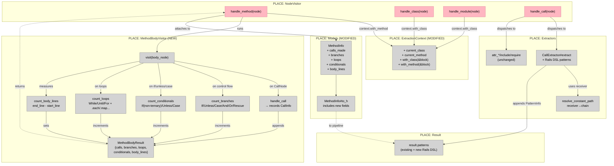

# Phase 1: Extractor Enhancement — Shaping

**Selected shape:** B — MethodBodyVisitor + Extend CallExtractor for Rails DSL

**Status:** Shaping complete. Ready for slicing.

**Verified:**
- Shape B (MethodBodyVisitor + CallExtractor extension) satisfies all core requirements R0–R6 and R8 per the fit-check table
- Spike B2 confirmed Prism AST node types, field names, and the LOOP_METHODS mapping against real code
- Parts breakdown (B1–B10) covers every mechanism needed: value object, visitor, context changes, model changes, argument encoding, receiver resolution, and tests
- Breadboards map current state → proposed state with all affordances wired end-to-end
- Existing test suite identified as the regression gate for R3

**How verified:**
- Design walkthrough: each requirement (R0–R8) was checked against Shape B's mechanisms (fit-check table, lines 52–64)
- Spike B2: empirical Prism AST inspection of representative method bodies (see spike-b2.md)
- Affordance tables and wiring diagram trace every data flow from visitor entry to serialized output

**Not verified / caveats:**
- No implementation code exists yet — all verification is at the design level
- Spike B2 is the only completed spike; additional exploration may surface edge cases in argument encoding or receiver resolution
- R7 (define_method) is explicitly deferred to Phase 6
- The Rails DSL pattern list (B6) covers standard Rails but may need expansion for non-standard gems or custom DSLs
- Real-world performance on large codebases has not been profiled

---

## Frame

### Problem

The extractor captures method signatures but does not analyze method bodies. The `MethodExtractor` records name, params, and visibility — but never looks inside the method. The `CallExtractor` only handles top-level AST patterns (`attr_*`, `include`, `require`, `alias_method`) and silently drops every other call.

This means:
- Rails enrichers (ModelEnricher, ControllerEnricher) can't detect `has_many`, `validates`, `before_action`, `scope` — they iterate `method.calls_made` which is never populated
- Method call graphs are empty — the InputAdapter explicitly sets `method_calls: []` with the comment "Extractor doesn't provide method_calls"
- Complexity/quality metrics have no data — `NormalizedMethod` fields `branches`, `loops`, `conditionals`, `body_lines` are never populated
- Everything downstream of the extractor is starved of data

### Outcome

- Every method records the calls it makes, with receiver chain, method name, and arguments in parseable form
- Every method records control flow counts (branches, loops, conditionals) and body line count
- Rails DSL calls at class body level (`has_many`, `validates`, `before_action`, `scope`, `rescue_from`, `delegate`) are captured as structured patterns on the parent class
- Call data and metrics flow through `MethodInfo` and survive `to_h` serialization
- Existing extractor behavior is unchanged — all current node types continue to work
- The extractor remains purely static — no runtime execution

---

## Requirements (R)

| ID | Requirement | Status |
|----|-------------|--------|
| R0 | Every method records the calls it makes — receiver, method name, arguments | Core goal |
| R1 | Every method records branches, loops, conditionals, and body line count | Must-have |
| R2 | Class-level Rails DSL calls (has_many, validates, before_action, scope, rescue_from, delegate) are captured on their parent class/module | Must-have |
| R3 | The extractor continues to handle all existing node types without regression | Must-have |
| R4 | Call data flows through MethodInfo and survives to_h serialization | Must-have |
| R5 | Call argument values are preserved in a form downstream consumers can parse (symbols → name, strings → value, keywords → hash, blocks → source text) | Must-have |
| R6 | Namespaced call receivers are resolved from the AST (e.g., `Rails.logger.info` → chain `["Rails", "logger"]`, method `info`) | Must-have |
| R7 | define_method and block-based DSL method production — deferred to runtime (Phase 6) | Out |
| R8 | Block arguments on calls are captured as "this argument is a lambda/block" plus its source text | Must-have |

---

## Shape B: MethodBodyVisitor + Extend CallExtractor for Rails DSL

A new dedicated visitor (`MethodBodyVisitor`) traverses method bodies and records calls + control flow counts. `CallExtractor` gets extended with Rails DSL pattern matching but keeps its existing responsibilities. Two components, clean separation — "what calls does a method make?" vs "what patterns exist at the class body level?"

### Fit Check (R × B)

| Req | Requirement | Status | B |
|-----|-------------|--------|---|
| R0 | Every method records the calls it makes — receiver, method name, arguments | Core goal | ✅ |
| R1 | Every method records branches, loops, conditionals, and body line count | Must-have | ✅ |
| R2 | Class-level Rails DSL calls captured on parent class/module | Must-have | ✅ |
| R3 | No regression on existing node types | Must-have | ✅ |
| R4 | Call data flows through MethodInfo and survives to_h serialization | Must-have | ✅ |
| R5 | Argument values preserved in parseable form | Must-have | ✅ |
| R6 | Namespaced call receivers resolved from AST | Must-have | ✅ |
| R7 | define_method deferred to runtime | Out | ✅ |
| R8 | Block arguments captured as "lambda/block" + source text | Must-have | ✅ |

---

### Parts

| Part | Mechanism | Flag |
|------|-----------|:----:|
| **B1** | New `MethodBodyResult` value object — `{calls:, branches:, loops:, conditionals:, body_lines:}` | |
| **B2** | New `MethodBodyVisitor` class — recursively walks method body, records CallInfo on every `CallNode`, increments counters based on node type map (see spike), measures body lines from DefNode location | |
| **B3** | `NodeVisitor#handle_method`: wrap body in `context.with_method`, run `MethodBodyVisitor`, attach `MethodBodyResult` to last `MethodInfo` | |
| **B4** | `NodeVisitor#handle_class` and `#handle_module`: wrap in `context.with_class(name)` so CallExtractor knows the parent class when recording Rails DSL patterns | |
| **B5** | `MethodInfo` model — add `calls_made` (Array\<Hash\>), `branches`, `loops`, `conditionals`, `body_lines` (Integer); update `to_h` | |
| **B6** | `CallExtractor#extract` — extend `case node.name` with Rails DSL patterns. Each records `PatternInfo(type: "rails_dsl", method:, target: context.current_class, arguments:)` | |
| **B7** | `CallExtractor` — add `resolve_constant_path` helper for receiver resolution (R6) on Rails DSL calls | |
| **B8** | `MethodBodyVisitor` — `extract_args` helper for argument encoding (R5, R8): maps each Prism argument node type to `{type:, value:}` hash | |
| **B9** | `ExtractionContext` — add `current_class` and `current_method` fields + `with_class`/`with_method` scope methods | |
| **B10** | Tests: MethodBodyVisitor spec (call recording + counting across representative method bodies), updated MethodInfo spec (new fields, to_h), updated CallExtractor spec (Rails patterns), updated NodeVisitor spec (integration) | |

### Rails DSL patterns added to CallExtractor (B6)

```
when :has_many, :has_one, :belongs_to, :has_and_belongs_to_many
  → PatternInfo(type: "rails_dsl", method: node.name, target: context.current_class, arguments: extract_call_arguments(node))

when :validates, :validates_presence_of, :validates_uniqueness_of, :validates_length_of,
     :validates_format_of, :validates_inclusion_of, :validates_exclusion_of,
     :validates_numericality_of, :validates_acceptance_of, :validates_confirmation_of,
     :validates_associated, :validates_each, :validate
  → same pattern

when :before_action, :after_action, :around_action,
     :skip_before_action, :skip_after_action, :skip_around_action,
     :before_filter, :after_filter, :around_filter
  → same pattern

when :scope, :default_scope
  → same pattern

when :rescue_from
  → same pattern

when :delegate
  → same pattern (already in CallExtractor? No — add it)
```

### MethodBodyVisitor node type → action map (confirmed by spike B2)

| Prism node type | Action |
|-----------------|--------|
| `CallNode` | Record `{receiver:, method:, arguments:, has_block:}` into calls list. If `node.name` is in LOOP_METHODS and `node.block` is present → increment loops |
| `IfNode` | If `if_keyword_loc` is nil → increment branches only (ternary). Else → increment both branches and conditionals |
| `UnlessNode` | Increment branches + conditionals |
| `CaseNode` | Increment branches + conditionals |
| `WhileNode`, `UntilNode`, `ForNode` | Increment loops |
| `AndNode`, `OrNode` | Increment branches |
| `RescueModifierNode` | Increment branches |
| `BeginNode` | If `rescue_clause` is present → increment branches |
| `StatementsNode`, `ArgumentsNode`, `ElseNode`, `WhenNode`, `RescueNode`, `BlockNode`, `BlockParametersNode`, `ParametersNode`, `LambdaNode`, `AssocNode`, `KeywordHashNode`, `LocalVariableReadNode`, `LocalVariableTargetNode` | Recurse into children only — no counting |
| All leaf/value types | No-op (no children) |

LOOP_METHODS: `%w[each map collect select reject find detect reduce inject times upto downto step each_with_index each_with_object group_by partition sort_by flat_map]`

### Argument encoding (extract_args — B8)

Each argument in `ArgumentsNode#arguments` is mapped:

| Prism type | Encoded as |
|-----------|-----------|
| `SymbolNode` | `{type: :symbol, value: node.unescaped}` |
| `StringNode` | `{type: :string, value: node.unescaped}` |
| `IntegerNode` | `{type: :integer, value: node.value}` |
| `FloatNode` | `{type: :float, value: node.value}` |
| `TrueNode` | `{type: :boolean, value: true}` |
| `FalseNode` | `{type: :boolean, value: false}` |
| `NilNode` | `{type: :nil, value: nil}` |
| `KeywordHashNode` | `{type: :hash, pairs: [{key: extract(key), value: extract(value)}, ...]}` |
| `LambdaNode` | `{type: :block, source: node.slice}` |
| `CallNode` | `{type: :call, receiver: resolve_chain(node.receiver), method: node.name.to_s}` (shallow) |
| `ConstantReadNode` | `{type: :constant, value: node.name.to_s}` |
| `ArrayNode` | `{type: :array, elements: [...]}` (recursive) |

### Receiver resolution (resolve_chain — B7)

Walk up the receiver chain and return array of constant names:
- `nil` → `nil` (self call)
- `ConstantReadNode` → `[node.name.to_s]`
- `ConstantPathNode` → `resolve_chain(parent) + [node.name.to_s]`
- `CallNode` → `resolve_chain(node.receiver) + [node.name.to_s]`
- `SelfNode` → `["self"]`

---

## Spikes

- [x] **B2 spike** — Prism AST node types in method bodies: [spike-b2.md](spike-b2.md) — **COMPLETE**. Confirmed all node types and field names. B2 flag resolved.

---

## Breadboards

### CURRENT System (for reference)

```
PLACE: Extractor/NodeVisitor
  ┌─────────────────────────────────────────┐
  │ NodeVisitor                             │
  │                                         │
  │ U1: visit(node)                         │
  │   └─ dispatches to handler by node type │
  │                                         │
  │ U2: handle_class(node)                  │
  │   └─ ClassExtractor#extract(node)       │
  │   └─ visit_children(node)               │
  │                                         │
  │ U3: handle_method(node)                 │
  │   └─ MethodExtractor#extract(node)      │
  │   └─ visit_children(node) ← body nodes  │
  │                                         │
  │ U4: handle_call(node)                   │
  │   └─ CallExtractor#extract(node)        │
  │      └─ case node.name:                 │
  │         attr_* → record AttributeInfo   │
  │         include/extend → record Mixin   │
  │         require → record Dependency     │
  │         (else: silently drop)           │
  └─────────────────────────────────────────┘

PLACE: Extractor/Models
  N1: MethodInfo
    - name, visibility, receiver_type
    - params, location, doc, namespace, owner
    - NO calls_made, NO body metrics

PLACE: Extractor/Context
  N2: ExtractionContext
    - current_namespace (Array)
    - current_visibility (Symbol)
    - NO current_class, NO current_method
```

### Proposed System (Shape B)

```
PLACE: Extractor/NodeVisitor
  ┌──────────────────────────────────────────┐
  │ NodeVisitor (modified)                   │
  │                                          │
  │ U1: visit(node) [unchanged]              │
  │                                          │
  │ U2: handle_class(node) [MODIFIED]        │
  │   └─ ClassExtractor#extract(node)        │
  │   └─ context.with_class(name) do         │  ← NEW
  │       visit_children(node)               │
  │     end                                  │
  │                                          │
  │ U3: handle_method(node) [MODIFIED]       │
  │   └─ MethodExtractor#extract(node)       │
  │   └─ context.with_method(name) do        │  ← NEW
  │       body_result = MethodBodyVisitor    │  ← NEW
  │         .new.visit(node.body)            │
  │       attach_to_method(body_result)      │  ← NEW
  │     end                                  │
  │                                          │
  │ U4: handle_call(node) [EXTENDED]         │  ← still dispatches to CallExtractor
  │   └─ CallExtractor#extract(node)         │
  │      └─ case node.name:                  │
  │         + has_many → record PatternInfo   │
  │         + validates → record PatternInfo  │
  │         + before_action → record Pattern  │
  │         + scope → record PatternInfo      │
  │         + rescue_from → record Pattern    │
  │         + delegate → record PatternInfo   │
  └──────────────────────────────────────────┘

PLACE: Extractor/MethodBodyVisitor (NEW)
  ┌──────────────────────────────────────────┐
  │ MethodBodyVisitor                        │
  │                                          │
  │ N3: visit(node)                          │
  │   └─ recurse into body, dispatch by type │
  │                                          │
  │ N4: handle_call(node)                    │
  │   └─ record CallInfo:                    │
  │      { receiver: resolve_chain(...),     │
  │        method: node.name.to_s,           │
  │        arguments: extract_args(node),    │
  │        has_block: !!node.block }         │
  │   └─ if loop method + has block → loop++ │
  │                                          │
  │ N5: count_branches(node)                 │
  │   └─ IfNode/UnlessNode/CaseNode/         │
  │      AndNode/OrNode/RescueModifierNode   │
  │      /BeginNode with rescue_clause       │
  │                                          │
  │ N6: count_conditionals(node)             │
  │   └─ IfNode(not ternary)/UnlessNode/     │
  │      CaseNode                            │
  │                                          │
  │ N7: count_loops(node)                    │
  │   └─ WhileNode/UntilNode/ForNode         │
  │      + CallNode with block + loop method │
  │                                          │
  │ N8: count_body_lines(method_node)        │
  │   └─ method_node.location.end_line       │
  │      - method_node.location.start_line   │
  └──────────────────────────────────────────┘

PLACE: Extractor/Models (MODIFIED)
  ┌──────────────────────────────────────────┐
  │ N9: MethodInfo (modified)                │
  │   + calls_made: Array<Hash>              │
  │   + branches: Integer                    │
  │   + loops: Integer                       │
  │   + conditionals: Integer                │
  │   + body_lines: Integer                  │
  │                                          │
  │ N10: MethodInfo#to_h (modified)          │
  │   + includes new fields in output hash   │
  └──────────────────────────────────────────┘

PLACE: Extractor/Context (MODIFIED)
  ┌──────────────────────────────────────────┐
  │ N11: ExtractionContext (modified)         │
  │   + current_class (String)               │
  │   + current_method (String)              │
  │   + with_class(name, &block)             │
  │   + with_method(name, &block)            │
  └──────────────────────────────────────────┘
```

### Affordance Tables

#### UI Affordances (NodeVisitor handler methods)

| ID | Affordance | Wires Out | Returns To |
|----|-----------|-----------|------------|
| U1 | `visit(node)` — dispatches by type | → handler method | — |
| U2 | `handle_class(node)` — extract class + wrap in with_class | → ClassExtractor, N11 | — |
| U3 | `handle_method(node)` — extract method + run MethodBodyVisitor + attach result | → MethodExtractor, N3, N9 | — |
| U4 | `handle_call(node)` — dispatch to CallExtractor | → N12 | — |

#### Non-UI Affordances

| ID | Affordance | Type | Wires Out | Returns To |
|----|-----------|------|-----------|------------|
| N1 | `MethodBodyResult` — value object `{calls:, branches:, loops:, conditionals:, body_lines:}` | Data | — | N3 returns this |
| N2 | `MethodBodyVisitor` — recursive body walker | Handler | N1 | MethodBodyResult |
| N3 | `handle_call` (inside MethodBodyVisitor) — record CallInfo | Handler | → appends to calls list | — |
| N4 | `count_branches` — increment on control flow nodes | Counter | → increments branches | — |
| N5 | `count_conditionals` — increment on if/unless/case (non-ternary) | Counter | → increments conditionals | — |
| N6 | `count_loops` — increment on while/until/for + block iteration calls | Counter | → increments loops | — |
| N7 | `count_body_lines` — compute from DefNode location | Calculator | → sets body_lines | — |
| N8 | `MethodInfo` + calls_made, branches, loops, conditionals, body_lines | Data | → to_h → pipeline | — |
| N9 | `MethodInfo#to_h` — includes new fields | Formatter | → hash output | Hash |
| N10 | `ExtractionContext` + current_class, current_method, with_class, with_method | Data | — | — |
| N11 | `CallExtractor#extract` — extended case with Rails DSL patterns | Handler | → result.patterns << PatternInfo | — |
| N12 | `resolve_constant_path` — receiver → chain of constant names | Helper | — | Array\<String\> |
| N13 | `extract_args` — symbols→name, strings→value, keywords→hash, blocks→source_text | Helper | — | Array\<Hash\> |
| N14 | `NodeVisitor#handle_method` — runs MethodBodyVisitor, attaches result to last MethodInfo | Coordinator | → N2 → N8 | — |
| N15 | `NodeVisitor#handle_class/#handle_module` — wraps in with_class | Coordinator | → sets N10.current_class | — |

### Wiring Diagram



**Legend:**
- **Pink nodes (U)** = UI affordances (NodeVisitor handler methods)
- **Grey nodes (N)** = Code affordances (extractors, models, context, data)
- **Solid lines** = Wires Out (calls, dispatches, appends)
- **Dashed lines** = Returns To (return values)

---

## Existing Tests That Must Continue Passing

- `spec/extractor_spec.rb` — class/module/method extraction
- `spec/extractor/models/*_spec.rb` — model object tests
- `spec/extractor/node_visitor_spec.rb` — AST traversal
- `spec/extractor/services/*_spec.rb` — documentation and namespace services
- `spec/extractor/extractors/base_extractor_spec.rb` — base extractor behavior
- `spec/extractor/extraction_context_spec.rb` — context tests

These are the regression gate for R3.
