# Phase 1: Extractor Enhancement — Slices

**Parent:** [shaping.md](shaping.md)
**Selected shape:** B — MethodBodyVisitor + Extend CallExtractor for Rails DSL

---

## Vertical Slices

Four slices, each adding a testable capability:

| # | Slice | R's satisfied | Demo |
|---|-------|---------------|------|
| V1 | Call Recording | R0, R4, R5, R8 | Extract a method, inspect `calls_made` — real call data |
| V2 | Control Flow Metrics | R1 | Extract methods with if/while/each, inspect branch/loop/conditional/body_line counts |
| V3 | Rails DSL + Receiver Resolution | R2, R6 | Extract a Rails model with `has_many`, inspect `result.patterns` for Rails DSL entries |
| V4 | Integration & Regression | R3 | `bundle exec rspec` — 0 failures, all existing tests pass, new tests cover all patterns |

### Dependency

```text
V1 ──► V2 ──► V4
 │
 └──► V3 ──► V4
```

V2 extends V1's MethodBodyVisitor with counting. V3 is independent of V2 — Rails DSL detection doesn't depend on method body analysis. Both merge in V4.

---

## Sliced Breadboard

```mermaid
flowchart TB
    subgraph slice1["V1: CALL RECORDING"]
        U3["U3: handle_method(node)"]
        N14["N14: NodeVisitor#handle_method\nruns MethodBodyVisitor,\nattaches result"]
        N2["N2: MethodBodyVisitor\nvisit(body_node)\n→ call recording only"]
        N3["N3: handle_call\n→ records CallInfo"]
        N13["N13: extract_args\nsymbols→name, strings→value,\nkeywords→hash, blocks→source"]
        N1["N1: MethodBodyResult\n{calls:, branches:0,\nloops:0, conditionals:0,\nbody_lines:0}"]
        N10a["N10: ExtractionContext\n+ current_method\n+ with_method(&block)"]
        N8a["N8: MethodInfo\n+ calls_made"]
        N9["N9: MethodInfo#to_h\nincludes new fields"]
    end

    subgraph slice2["V2: CONTROL FLOW METRICS"]
        N2x["N2: MethodBodyVisitor\n+ counting logic"]
        N4["N4: count_branches\nIf/Unless/Case/\nAnd/Or/Rescue/Begin"]
        N5["N5: count_conditionals\nIf(non-ternary)/\nUnless/Case"]
        N6["N6: count_loops\nWhile/Until/For +\n.each/.map block calls"]
        N7["N7: count_body_lines\nend_line - start_line"]
        N8b["N8: MethodInfo\n+ branches, loops,\nconditionals, body_lines"]
    end

    subgraph slice3["V3: RAILS DSL + RECEIVER RESOLUTION"]
        U2["U2: handle_class(node)"]
        U4["U4: handle_call(node)"]
        N15["N15: NodeVisitor\nwith_class wrap"]
        N10b["N10: ExtractionContext\n+ current_class\n+ with_class(&block)"]
        N11["N11: CallExtractor#extract\n+ Rails DSL patterns\nhas_many, validates,\nbefore_action, scope..."]
        N12["N12: resolve_constant_path\nreceiver→chain"]
    end

    subgraph slice4["V4: INTEGRATION & REGRESSION"]
        existing["Existing extractors\nClass/Module/Method/\nConstant/Call"]
        R1["result.patterns\n(existing + new)"]
        R2["result.classes\nresult.methods\nresult.modules\n(all populated)"]
    end

    %% V1 internal wiring
    U3 -->|context.with_method| N10a
    U3 -->|runs| N14
    N14 --> N2
    N2 -->|on CallNode| N3
    N3 -->|extracts args| N13
    N3 -->|appends| N1
    N1 -.->|returns| U3
    U3 -->|attaches to| N8a
    N8a --> N9

    %% V2 extends V1
    N2 --> N2x
    N2x -->|on control flow nodes| N4
    N2x -->|on conditionals| N5
    N2x -->|on loops| N6
    N2x -->|measures| N7
    N4 -->|increments| N1
    N5 -->|increments| N1
    N6 -->|increments| N1
    N7 -->|sets| N1
    N8a --> N8b

    %% V3 wiring (independent of V2)
    U2 -->|context.with_class| N10b
    N15 -->|wraps| N10b
    U4 -->|dispatches to| N11
    N11 -->|uses receiver| N12

    %% V4 pulls everything together
    N9 -.->|to pipeline| R2
    N11 -->|appends PatternInfo| R1
    existing --> R2
    N8b --> R2

    %% Cross-slice: V3 patterns go to V4 result
    R1 -.-> slice4

    %% Force slice ordering
    slice1 ~~~ slice2
    slice2 ~~~ slice4
    slice3 ~~~ slice4

    %% Slice styling
    style slice1 fill:#e8f5e9,stroke:#4caf50,stroke-width:2px
    style slice2 fill:#e3f2fd,stroke:#2196f3,stroke-width:2px
    style slice3 fill:#fff3e0,stroke:#ff9800,stroke-width:2px
    style slice4 fill:#f3e5f5,stroke:#9c27b0,stroke-width:2px

    classDef ui fill:#ffb6c1,stroke:#d87093,color:#000
    classDef nonui fill:#d3d3d3,stroke:#808080,color:#000
    class U2,U3,U4 ui
    class N1,N2,N2x,N3,N4,N5,N6,N7,N8a,N8b,N9,N10a,N10b,N11,N12,N13,N14,N15,existing,R1,R2 nonui
```



**Legend:**
- **Pink nodes (U)** = NodeVisitor handler methods (the interface between AST and extractors)
- **Grey nodes (N)** = Code affordances (visitor, models, context, helpers)
- **Colored regions** = Slice boundaries
- **Solid lines** = Wires Out
- **Dashed lines** = Returns To

---

## Slices Grid

|  |  |
|:--|:--|
| **[V1: CALL RECORDING](./phase1-v1-plan.md)**<br>⏳ PENDING<br><br>• MethodBodyResult value object<br>• MethodBodyVisitor — call recording<br>• NodeVisitor#handle_method integration<br>• MethodInfo + calls_made + to_h<br>• ExtractionContext + current_method<br>• extract_args helper<br><br>*Demo: Extract a method, inspect calls_made* | **[V2: CONTROL FLOW METRICS](./phase1-v2-plan.md)**<br>⏳ PENDING<br><br>• MethodBodyVisitor — counting logic<br>• count_branches, count_conditionals<br>• count_loops, count_body_lines<br>• MethodInfo + count fields<br><br>*Demo: Extract methods, inspect branch/loop counts* |
| **[V3: RAILS DSL + RECEIVER](./phase1-v3-plan.md)**<br>⏳ PENDING<br><br>• CallExtractor Rails DSL patterns<br>• NodeVisitor handle_class/module wrap<br>• ExtractionContext + current_class<br>• resolve_constant_path helper<br><br>*Demo: Extract Rails model, inspect patterns* | **[V4: INTEGRATION & REGRESSION](./phase1-v4-plan.md)**<br>⏳ PENDING<br><br>• Full test coverage for all slices<br>• Existing test suite passes<br>• RubyMap.map end-to-end test<br>• Gold file for reference project<br><br>*Demo: bundle exec rspec — green* |

---

## Slice Affordance Assignments

### V1: Call Recording

| ID | Affordance | Type | Slice |
|----|-----------|------|:-----:|
| U3 | handle_method(node) — runs MethodBodyVisitor | UI | V1 |
| N1 | MethodBodyResult `{calls:, branches:, loops:, conditionals:, body_lines:}` | Data | V1 |
| N2 | MethodBodyVisitor — basic call recording (no counting) | Handler | V1 |
| N3 | handle_call — records {receiver:, method:, arguments:, has_block:} | Handler | V1 |
| N8 | MethodInfo + calls_made + to_h (partial) | Data | V1 |
| N9 | MethodInfo#to_h — includes new fields | Formatter | V1 |
| N10 | ExtractionContext + current_method + with_method | Data | V1 |
| N13 | extract_args — symbols→name, strings→value, keywords→hash, blocks→source_text | Helper | V1 |
| N14 | NodeVisitor#handle_method — runs MethodBodyVisitor, attaches result | Coordinator | V1 |

### V2: Control Flow Metrics

| ID | Affordance | Type | Slice |
|----|-----------|------|:-----:|
| N2 | MethodBodyVisitor — extended with counting logic | Handler | V2 |
| N4 | count_branches — IfNode/UnlessNode/CaseNode/AndNode/OrNode/RescueModifierNode/BeginNode | Counter | V2 |
| N5 | count_conditionals — IfNode(non-ternary)/UnlessNode/CaseNode | Counter | V2 |
| N6 | count_loops — WhileNode/UntilNode/ForNode + .each block calls | Counter | V2 |
| N7 | count_body_lines — end_line - start_line from DefNode location | Calculator | V2 |
| N8 | MethodInfo — extended with branches, loops, conditionals, body_lines | Data | V2 |

### V3: Rails DSL + Receiver Resolution

| ID | Affordance | Type | Slice |
|----|-----------|------|:-----:|
| U2 | handle_class(node) — wraps in with_class | UI | V3 |
| U4 | handle_call(node) — dispatches to CallExtractor (now with Rails DSL) | UI | V3 |
| N10 | ExtractionContext + current_class + with_class | Data | V3 |
| N11 | CallExtractor#extract — extended case with Rails DSL patterns | Handler | V3 |
| N12 | resolve_constant_path — receiver → chain of constant names | Helper | V3 |
| N15 | NodeVisitor#handle_class/#handle_module — with_class wrap | Coordinator | V3 |

### V4: Integration & Regression

| ID | Affordance | Type | Slice |
|----|-----------|------|:-----:|
| All V1-V3 affordances | — | — | V4 |
| existing_extractors | ClassExtractor, ModuleExtractor, CallExtractor (existing), etc. | Handlers | V4 |
| Tests | spec/extractor/**, spec/rubymap_spec.rb end-to-end | Tests | V4 |

---

## Existing Tests That Must Continue Passing (R3)

These are the regression gate — all must pass at every slice boundary:

- `spec/extractor_spec.rb` — class/module/method extraction
- `spec/extractor/models/*_spec.rb` — all model object tests
- `spec/extractor/node_visitor_spec.rb` — AST traversal
- `spec/extractor/services/*_spec.rb` — documentation and namespace services
- `spec/extractor/extractors/base_extractor_spec.rb` — base extractor
- `spec/extractor/extraction_context_spec.rb` — context behavior
- `spec/rubymap_spec.rb` — `.map` API tests
- `spec/normalizer_spec.rb` — normalizer (must still process extractor output)
